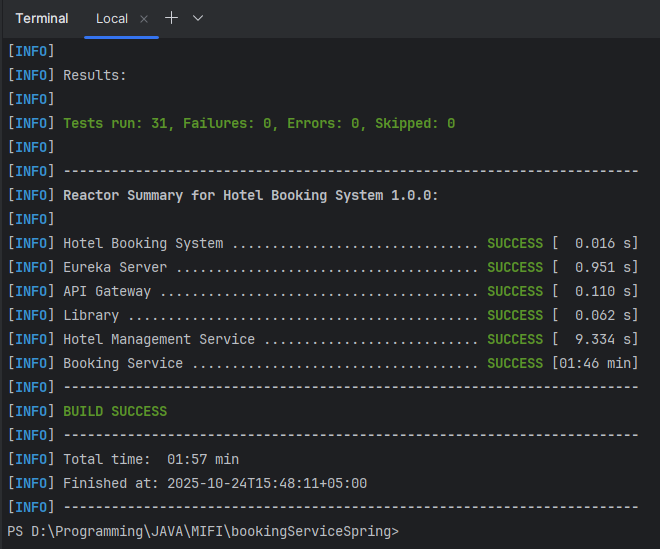

# Hotel Booking System

Микросервисная система бронирования отелей, построенная на Spring Boot и Spring Cloud.

## Архитектура

Система состоит из следующих микросервисов:

- **Eureka Server** (порт 8761) - Service Registry для обнаружения сервисов
- **API Gateway** (порт 8080) - Шлюз для маршрутизации запросов
- **Hotel Management Service** (порт 8081) - Управление отелями и номерами
- **Booking Service** (порт 8082) - Управление бронированиями и пользователями

## Функциональность

### Пользователи (USER)
- Регистрация и авторизация (JWT токены)
- Просмотр доступных отелей и номеров
- Создание бронирований (с автоподбором комнат)
- Просмотр истории бронирований
- Отмена бронирований

### Администраторы (ADMIN)
- CRUD операции с отелями и номерами
- Управление пользователями
- Просмотр статистики загруженности

## Технические особенности

- **Распределенные транзакции**: Двухшаговая согласованность между сервисами
- **Идемпотентность**: Повторные запросы не создают дубликатов
- **Retry механизм**: Автоматические повторы с экспоненциальной задержкой
- **Компенсация**: Откат изменений при ошибках
- **JWT аутентификация**: Безопасность на уровне каждого сервиса

## Запуск системы

### Предварительные требования
- Java 17+
- Maven 3.6+

### Локальный запуск

1. **Запуск Eureka Server**:
```bash
cd eureka-server
mvn spring-boot:run
```

2. **Запуск Hotel Management Service**:
```bash
cd hotel-management-service
mvn spring-boot:run
```

3. **Запуск Booking Service**:
```bash
cd booking-service
mvn spring-boot:run
```

4. **Запуск API Gateway**:
```bash
cd api-gateway
mvn spring-boot:run
```

## API Endpoints

### Регистрация и авторизация
- `POST /api/user/register` - Регистрация пользователя
- `POST /api/user/auth` - Авторизация пользователя

### Бронирования (требует авторизации)
- `POST /api/booking` - Создать бронирование
- `GET /api/bookings` - История бронирований
- `GET /api/booking/{id}` - Получить бронирование
- `DELETE /api/booking/{id}` - Отменить бронирование

### Отели и номера
- `GET /api/hotels` - Список отелей
- `GET /api/rooms` - Список доступных номеров
- `GET /api/rooms/recommend` - Рекомендуемые номера

### Административные операции (требует роль ADMIN)
- `POST /api/hotels` - Создать отель
- `POST /api/rooms` - Создать номер
- `GET /api/user` - Список пользователей
- `POST /api/user` - Создать пользователя
- `PATCH /api/user/{id}` - Обновить пользователя
- `DELETE /api/user/{id}` - Удалить пользователя

### Внутренние операции (INTERNAL)
- `POST /api/rooms/{id}/confirm-availability` - Подтвердить доступность номера
- `POST /api/rooms/{id}/release` - Снять блокировку номера

## Swagger документация
(Открыт доступ в Security config)
После запуска сервисов документация доступна по адресам:
- Hotel Management Service: http://localhost:8081/swagger-ui/index.html
- Booking Service: http://localhost:8082/swagger-ui/index.html

## База данных
(Открыт доступ в Security config)
Каждый сервис использует in-memory H2 базу данных:
- Hotel Management Service: http://localhost:8081/h2-console
- Booking Service: http://localhost:8082/h2-console
#### Полная схема базы данных [DATABASE_SCHEMA.md](DATABASE_SCHEMA.md)

## Мониторинг

- Eureka Dashboard: http://localhost:8761
- H2 Console: доступна для каждого сервиса на соответствующем порту

## Тестирование
Для запуска тестов:
```bash
mvn test
# Только тесты Booking Service
mvn test -pl booking-service
# Только тесты Hotel Management Service
mvn test -pl hotel-management-service
```
# Результаты тестов




# Тестирование системы бронирования отелей

## Обзор тестов

Система включает полный набор интеграционных тестов, покрывающих все критические сценарии:

### **Booking Service Tests**

#### 1. **BookingServiceIntegrationTest**
- Регистрация и авторизация пользователей
- Создание бронирований (обычных и с автоподбором)
- Получение истории бронирований
- Отмена бронирований
- Проверка авторизации и валидации

#### 2. **DistributedTransactionTest**
- **Подтверждение бронирований** - успешный сценарий
- **Компенсация при сбоях** - отмена при ошибках Hotel Service
- **Идемпотентность** - повторные запросы не создают дубликатов
- **Retry механизм** - автоматические повторы с экспоненциальной задержкой
- **Исчерпание повторов** - компенсация после неудачных попыток

#### 3. **ConcurrentBookingTest**
- **Параллельные бронирования** одного номера
- **Конфликты бронирований** - корректная обработка пересечений
- **Race conditions** - предотвращение гонок данных
- **Автоподбор при параллельных запросах**
- **Retry при параллельных запросах**

#### 4. **NegativeScenarioTest**
- **Неверные данные** - валидация входных параметров
- **Таймауты сервисов** - обработка недоступности Hotel Service
- **Неавторизованный доступ** - проверка безопасности
- **Несуществующие ресурсы** - обработка ошибок 404
- **Нарушения ограничений БД** - обработка конфликтов

###  **Hotel Management Service Tests**

#### 5. **HotelManagementServiceIntegrationTest**
- **CRUD операции** с отелями и номерами
- **Подтверждение доступности** номеров
- **Идемпотентность** запросов доступности
- **Конфликты бронирований** - предотвращение пересечений
- **Освобождение номеров** - компенсационные действия
- **Статистика загруженности** - счетчик times_booked
- **Параллельные запросы** доступности
- **Авторизация** - проверка ролей ADMIN/USER

#### Итог: все тесты проверяют успешную работу сервиса
-  **Корректную работу распределенных транзакций**
-  **Обработку параллельных запросов без гонок данных**
-  **Компенсацию при ошибках и таймаутах**
-  **Идемпотентность операций**
-  **Retry механизм с экспоненциальной задержкой**
-  **Валидацию входных данных**
- **Безопасность и авторизацию**

## Структура проекта

```
hotel-booking-system/
├── eureka-server/              # Service Registry
├── api-gateway/                # API Gateway
├── hotel-management-service/   # Hotel & Room management
├── booking-service/            # Booking & User management
├── common-lib/                 # Общая library по DRY
└── pom.xml                     # Parent POM
```
